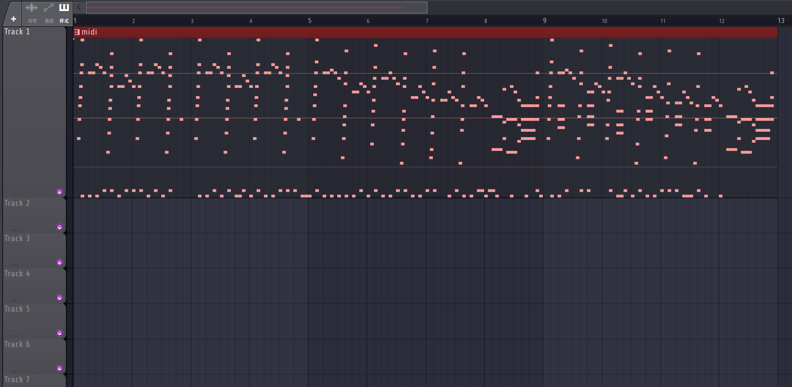
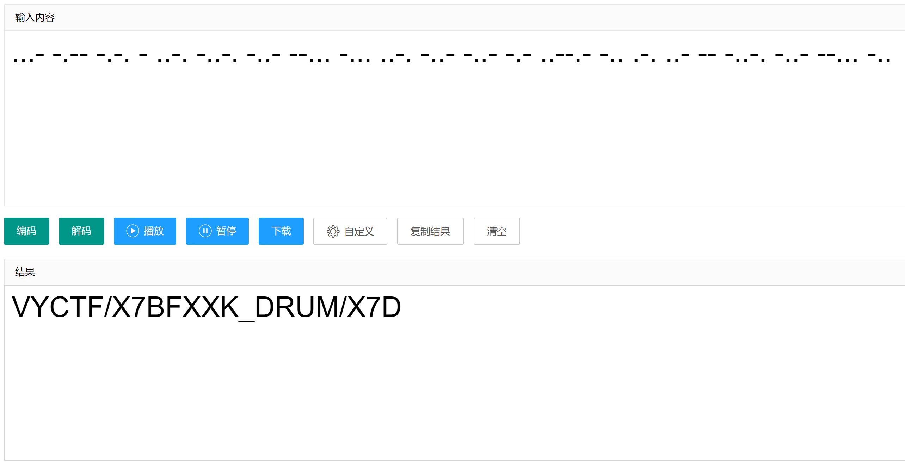
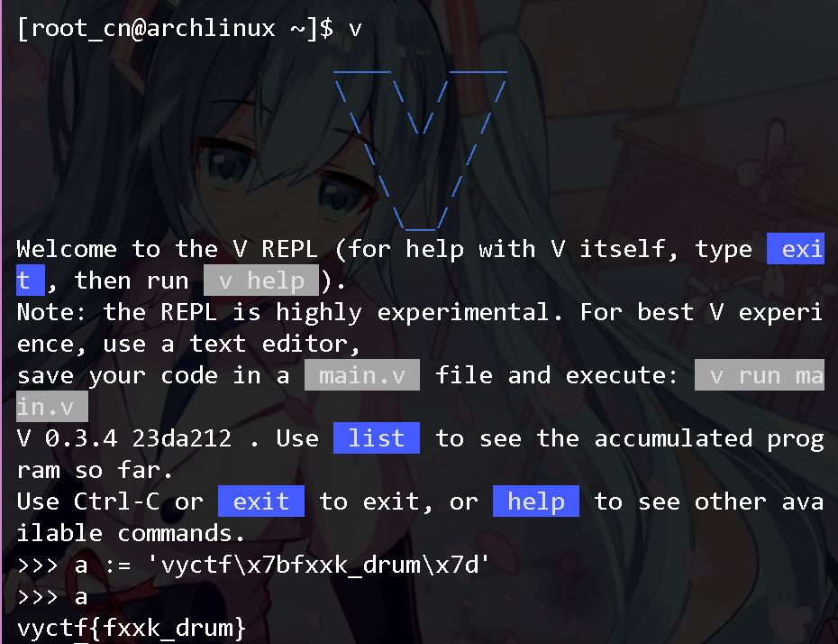

# 帕格尼尼的绝望

## 解题思路
很简单但是有趣的一题, 在帕格尼尼24号随想曲(准确来说是李斯特改编的第六号练习钢琴曲)中出现了意义不明的古典,

按照节拍可以将两种鼓组分为`.`和`-`, 通过莫斯密码可以得到以下字符串:

`vyctf/x7bfxxk_drum/x7d`
很明显`/x7b`与`/x7d`为ascii编码格式, 随便找个网站或者使用[python](https://www.python.org/), [vlang](https://vlang.io/)进行解码:

得到flag:
`vyctf{fxxk_drum}`