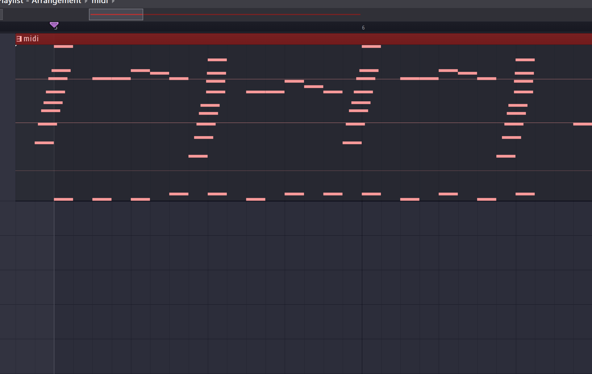

# 帕格尼尼的绝望

## 解题思路
很简单但是有趣的一题, 在帕格尼尼24号随想曲(准确来说是李斯特改编的第六号练习钢琴曲)中出现了意义不明的古典,

按照节拍可以将两种鼓组分为`.`和`-`, 通过莫斯密码可以得到以下字符串:

`vyctf/x7bfxxk_drum/x7d`
很明显`/x7b`与`/x7d`为ascii编码格式, 随便找个网站或者使用[python](https://www.python.org/), [vlang](https://vlang.io/)进行解码:

得到flag:
`vyctf{fxxk_drum}`

## 详细解题流程
没想到我感觉很简单的一题会对选手们造成困扰, 重新补写以下解题流程:
### 第一步: 找异常
找异常, 给出的音频明显是[帕格尼尼24号随想曲](https://www.bilibili.com/video/BV1BW41117L4/?spm_id_from=333.337.search-card.all.click)的李斯克改编练习曲, 属于古典乐曲. 根据常识, 在古典乐中加入鼓组是很亵渎的行为, 故本题着重于对异常的鼓组进行研究.
### 第二步: 小节对齐
好像大部分ctfer都卡在了这里, 有一个比较重要的地方, 因为钢琴部分存在刮奏, 为了在midi中体现出来, 所以是没有进行对齐的, 大家可能从开始部分直接计算, 那么对于鼓组来说是在打反拍, 实际上我们应该对鼓组和钢琴进行对齐, 让鼓组落在第一拍, 即如下所示:

### 第三步:长短
这一步可能会稍微有点脑洞, 从我们可以听出是drum和snare开eq去比较可以得知drum的范围整体比snare大, 所以drum部分为长, snare为短, 相当于换算为摩斯密码.
### 第四步:编码
这应该很基础, 找个地方换算得到的数据中存在ascii编码, 只需改一改就好.