# web

## 玩蛇（两道题一样）

考的是js跳过，但是我并不会，索性有火狐，F12直接出

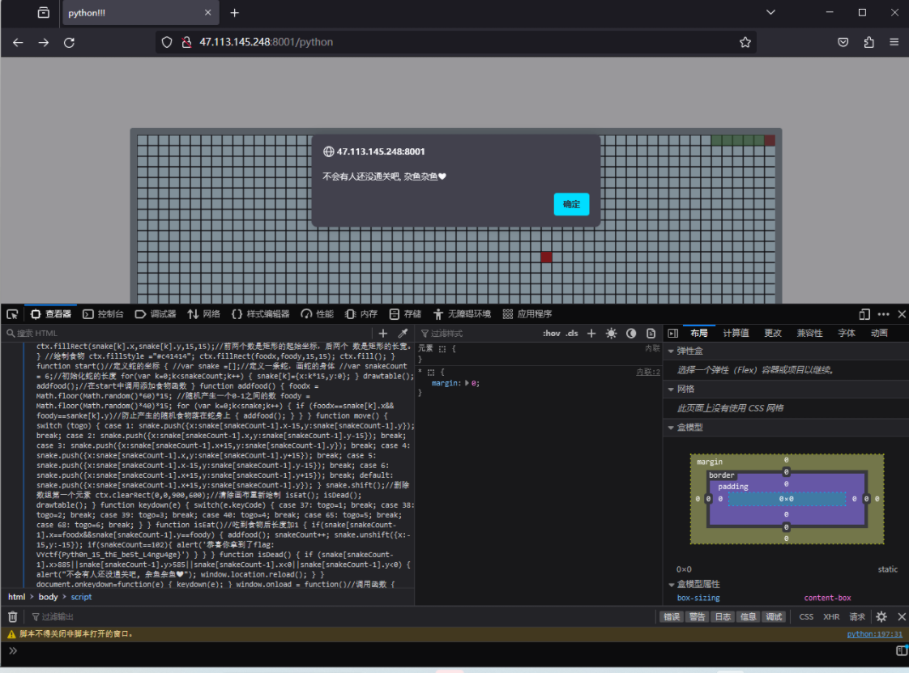

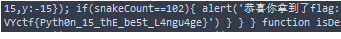

## 小恐龙

打开发现色块很多，打开F12直接全找一遍，找到色块看到开头89504e47，png文件头，思路一下子就清晰了，先用python脚本提取“color：#”后面的十六进制数据，然后十六进制转换成图片就好了。

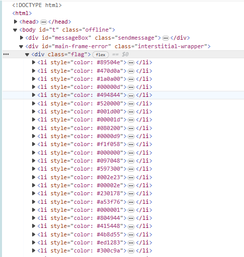

## 玩具沙盒

ssti模板注入，Django类的flask框架用{{}}注入

post传入flag={{}}，得出flag（太温柔了，他真的我哭死）。

# MISC

## 这亦是一种图片

首先拿到一个xxd.png图片，打开发现显示不出来，拖到WinHex发现文件头尾没有出错，xxd是linux系统的一个命令，可以将任意文件转换为十六进制或二进制形式。知道后开始尝试

xxd -b xxd.png得到二进制数据，misc总是让人措手不及，好一个二进制图片！

## 缺少的专辑

这个把图片拖到到WinHex里,修改一下文件高度就出来了，懒得再搞一遍了，放个成功后的图(狗头保命.jpg)

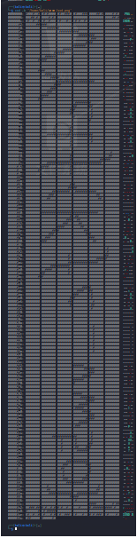

## 雪（snow）

知道snow是种HTML隐写加密方式，找一下网页版的就行，我用的snow程序。

SNOW.exe -p password [-C][-S] filename > outfile
[-C]是如果隐藏数据，则压缩数据，如果提取，则解压缩。

而[-S]是输出大致储存内容的大小

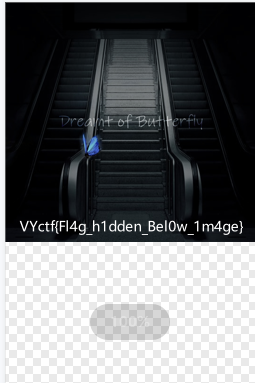

# crypto

## 还原大师

代码有两部分错误

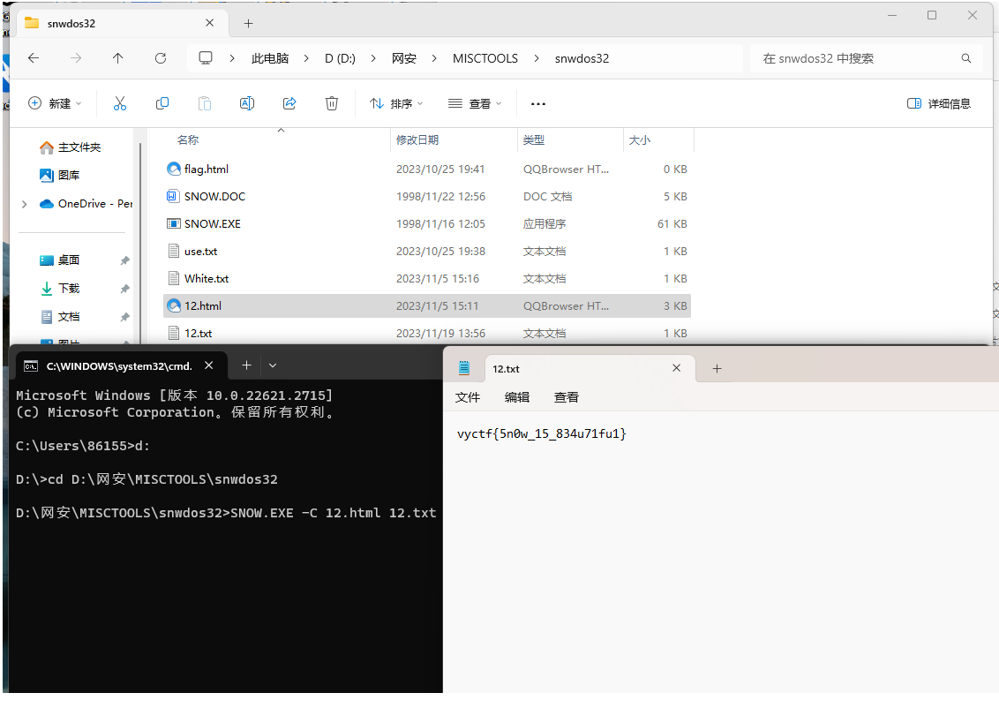

这里是每行只给了9个字符，少一个，可以先在最后随便填补上一个字符，先让程序运行在根据结果还原。

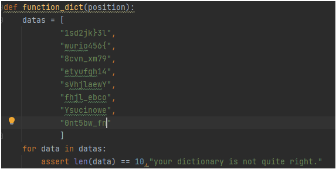

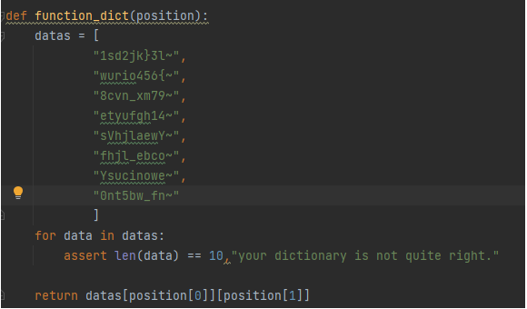

这里是让括号左边的值是右边的base64加密结果。

还原base64

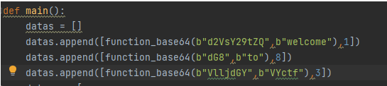

运行结果为

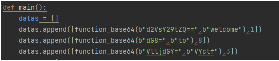

根据给出的提取字符的位置以及已知的条件（VYctf{}）来逐步修改

datas里十行字符串里，每行字符缺失的位置，推导完后如下

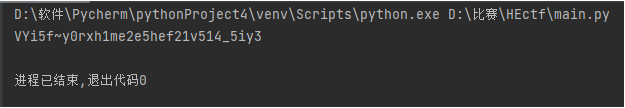

结果为

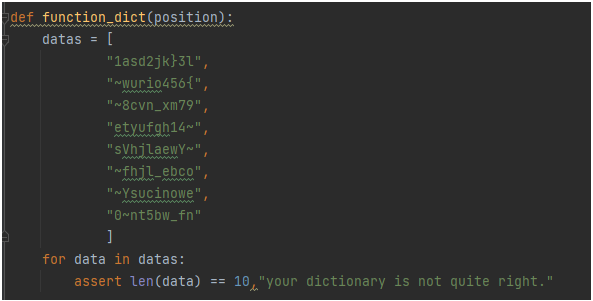

## 素数分解（rsa）

啥都给了，口算出结果（bushi），注意是逐个字符运算的结果

逐个提取出pt文件里的字符进行解密就行

## 小小的也很可爱

原汁原味的ElGamal加密算法

P = 487
E1 = 31
E2 = 168
R = 11

E2 = pow(E1, D, P)
C1 = pow(E1, R, P)

根据公式求出D为58

再根据C2的加密算法，逐个提取flag.ct的字符，注意用

with open（“flag.ct”,encoding='utf-8')

逐个算出 i 的值就是flag

# virus

## kawaii病毒

原理没学透，就是大致读懂了病毒代码，会检测文件数量

根据她的要求：
你能随意删除几个文件并推荐给其他机器吗？谢谢

创建一个文件夹1号，文件夹1号里创建一个文本文档和文件夹2号

打开病毒，删除文本文档并将病毒复制到文件夹2号，点击确定，拿到flag

# RE

## 大家一起和平玩耍吧

玩游戏做出来的，还是很好通关的。
