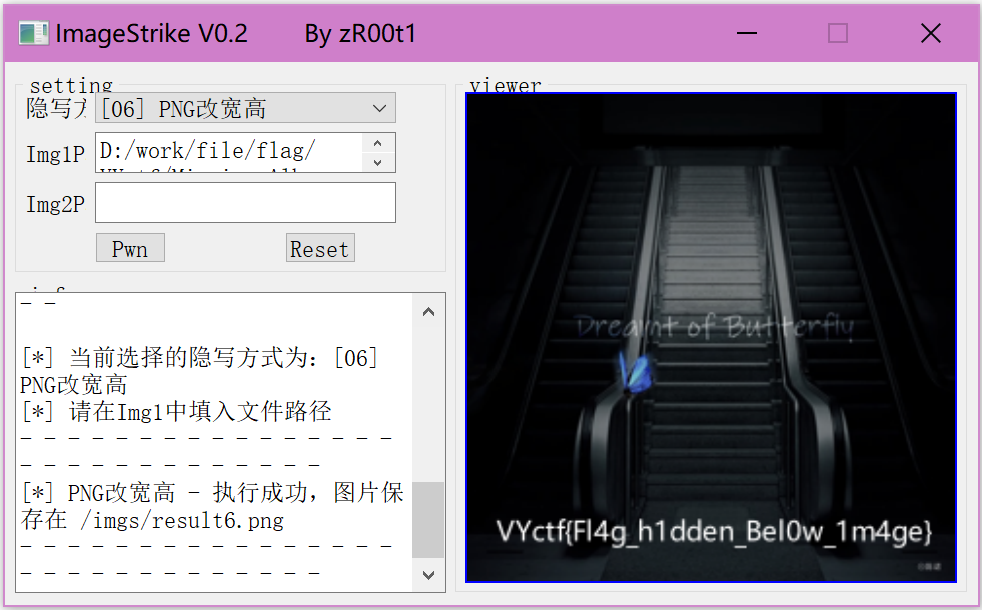

# 缺少的专辑
提示: 某位不要脸的网易云音乐人将自己的专辑图片放了出来, 没记错的话好像叫陈诺?

# 解析
通过提示可以知道原图片为一张专辑, 通过对比可以发现宽高区别, 疑似宽高被改过, 这里使用imagestrike工具为例, 将图片拖入, 选择隐写方式为PNG改宽高, 得到结果:

也可以直接通过xxd指令修改宽高:

得到结果:`VYctf{Fl4g_h1dden_Bel0w_1m4ge}`