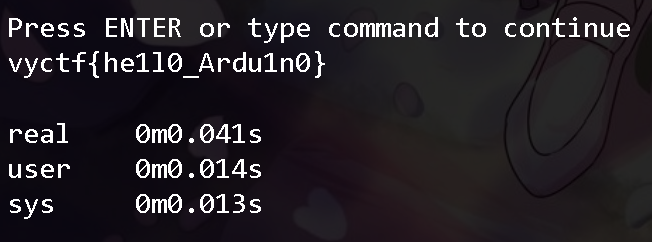

# 简单ino(签到)
很基础的小知识, lcd1602只有行16x列2的大小,对于超出部分无法显示

# 解题思路
直接进行[模拟](https://wokwi.com/projects/377468769415504897),可以得到10进制数字,将其进行ascii转码得到结果.
或者在知道原理的基础上进行代码爆破:
可参考[exp.py](./exp.py)文件:

得到结果:`vyctf{he1l0_Ardu1n0}`