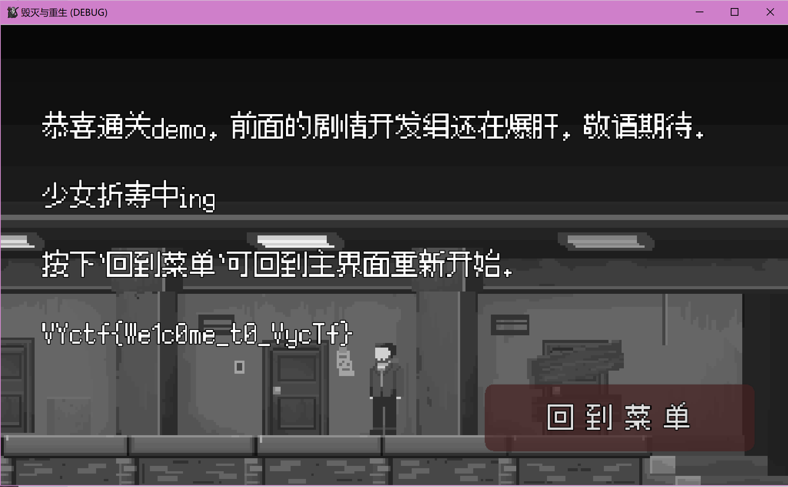
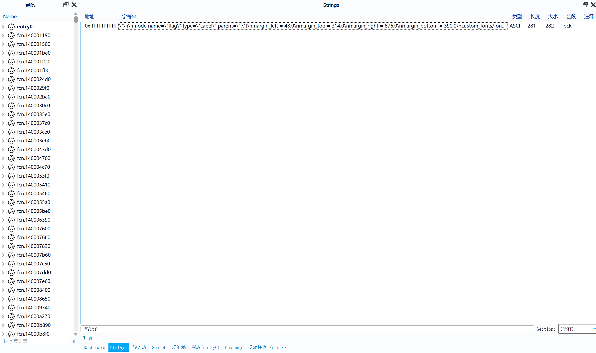

# 大家一起和平地玩耍吧(签到)
什么, 不会有杂鱼连游戏都通关不了吧?(笑)

## 解题思路
其实不通关也可以解出来, [源代码](https://gitee.com/cryingn/dar)已经给出了, 很明显, 我们的目的是对到达victory场景, 接下来用[cutter](https://gitee.com/sakana_ctf/cutter)进行解题, 以`毁灭与重生.exe`文件为例:
- 选择文件, 禁用分析
  
- 找到字符串(strings), 输入关键词
  
- 得到未加密的字符串
  `\"\n\n[node name=\"flag\" type=\"Label\" parent=\".\"]\nmargin_left = 48.0\nmargin_top = 314.0\nmargin_right = 876.0\nmargin_bottom = 390.0\ncustom_fonts/font = ExtResource( 1 )\ntext = \"VYctf{We1c0me_t0_VycTf}\"\n\n[connection signal=\"button_down\" from=\"play\" to=\".\" method=\"_on_play_button_down\"]\n`
- 审计结果
    - 已知在victory场景的节点处
    - 有一个类型(type)为Label的节点
    - 位置(position)在: 左48, 高314, 右876, 下390处
    - 里面的文字(text)为`VYctf{We1c0me_t0_VycTf}`
取得flag, 题目结束