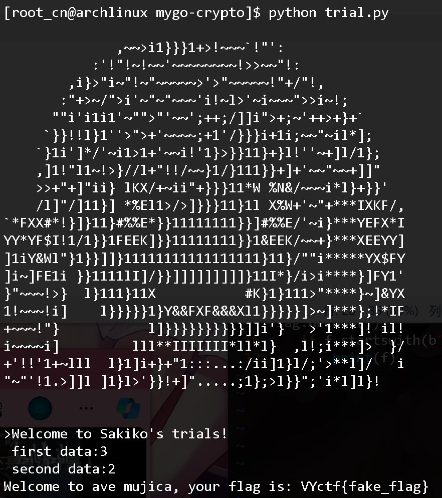

# 客服小祥的审判

本次密码题为mygo主题的关卡挑战题, 分为三个部分

## 你对组乐团感兴趣吗?
```python
if b <= 0:
    print("Please make me forget everything.\n")
    exit(0)

if pow(magic_number, a - 1, a) != 1:
    print("I wish you happiness.\n")
    exit(0)
```
前半部分防止b非正, 后半部分使$23456789^{a-1}\mod{a}=1$
即满足b >= 0, 由费马小定理得:a为素数.

## 弱小的我已经死掉了.
```python
trial_numbers = [rt(0, 26) for i in range(26)]

for number in trial_numbers:
    c = a + b * number
    if pow(magic_number, c - 1, c) != 1:
        print("You can't be soyo's mouthpiece.\n")
        exit(0)
```
同理需要使c为素数, 可参考卡克尔数:

>Thomas Wright proved that if 'a' and 'm' are relatively prime, then there are infinitely many Carmichael numbers in the arithmetic progression $(a+k \cdot m)$, where (k=1,2,...)
托马斯赖特证明了,'a'与'm'互素，则等差数列$(a+k \cdot m)$中有无穷多个卡迈克尔数，其中(k=1,2,...).


去前1000以内得素数对通过概率进行检验:
```python
for b in range(1, 1000):
    for a in [2, 3, 5, 7, 11, 13, 17, 19, 23, 29, 31, 37, 41, 43, 47, 53, 59, 61, 67, 71, 73, 79, 83, 89, 97, 101, 103, 107, 109, 113, 127, 131, 137, 139, 149, 151, 157, 163, 167, 173, 179, 181, 191, 193, 197, 199, 211, 223, 227, 229, 233, 239, 241, 251, 257, 263, 269, 271, 277, 281, 283, 293, 307, 311, 313, 317, 331, 337, 347, 349, 353, 359, 367, 373, 379, 383, 389, 397, 401, 409, 419, 421, 431, 433, 439, 443, 449, 457, 461, 463, 467, 479, 487, 491, 499, 503, 509, 521, 523, 541, 547, 557, 563, 569, 571, 577, 587, 593, 599, 601, 607, 613, 617, 619, 631, 641, 643, 647, 653, 659, 661, 673, 677, 683, 691, 701, 709, 719, 727, 733, 739, 743, 751, 757, 761, 769, 773, 787, 797, 809, 811, 821, 823, 827, 829, 839, 853, 857, 859, 863, 877, 881, 883, 887, 907, 911, 919, 929, 937, 941, 947, 953, 967, 971, 977, 983, 991, 997]:
        count = 0
        for i in range(27):
            c = a + b * i
            if pow(23456789,c-1,c) == 1:
                count += 1
        if count > 20:
            print(a,b)
            print(count)
# 3 2
# 22
# 5 2
# 21
# 7 2
# 21
# 11 2
# 21
# 13 2
# 21
```
可知`a, b = 3, 2`时频次最高, 将频次近似为概率, 取`a, b = 3, 2`进行爆破.
## 我无畏遗忘.
```python
d = a + b * max(trial_numbers)
if (d.bit_length() < 55):
    print(f"Welcome to ave mujica, your flag is: {flag}")
else:
    print("thank you for your feedback, but I'm not your mouthpiece.\n")
```
尽可能让数据足够小, 没什么多说的.


拿到flag(在服务器中正式flag为):`VYctf{k4n_b4ng_Dre4m_1t5_Myg0!!!!!_k4n_de}`


