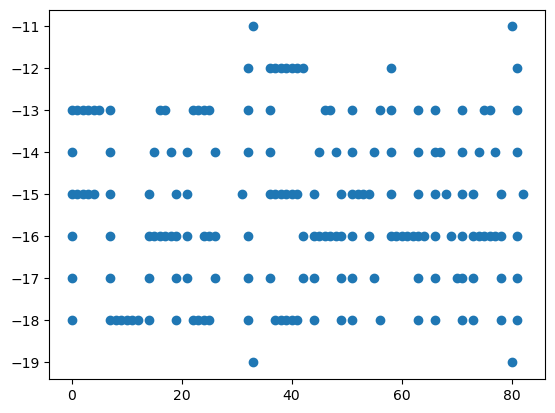
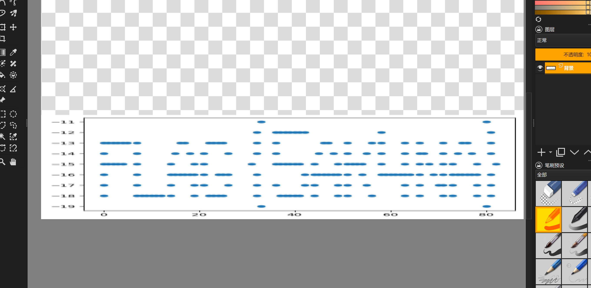

# 这亦是一种图片

这道题来自我以前测试矩阵方法的时候在bugku出的一道隐写题:

## 原题解析

拿到题目, 文件标注为xxd.png, 理所应当想到二进制或十六进制, 通过linux十六进制转换得到文件[xxd.new](./xxd.new):
```bash
xxd xxd.png > xxd.new
```
通过vim处理掉影响之后操作的多余部分, 得到文件[xxd](./xxd), 如[flag.ipynb](./flag.ipynb)使用python读取xxd文件, 将非0处转换为点坐标, 可以得到图像:

看起来不是很直观, 但是我懒, 不想调图像参数, 直接把图像保存导入进krita, 拉伸了以下,还是能看清flag的:

`flag{5ak4na}`
理论上可以通过print转换字符串拿到更清晰的版本, 不过好久没写jupyter了, 稍微复健一下, 按道理print出来的结果应该更直观, 不过可能需要考虑更多乱七八糟的东西.

## writeup

以上是我以前出的题目内容, 这次稍微在以前的基础上进行了更新, 大家可以按照原来的方法解答, 不过稍微要改一改脚本:
```bash
xxd -b xxd.png > xxd.new
```
以前是将加密内容随机生成写入了十六进制中, 这次稍微改了改题目, 用二进制的方式对数据进行储存.
