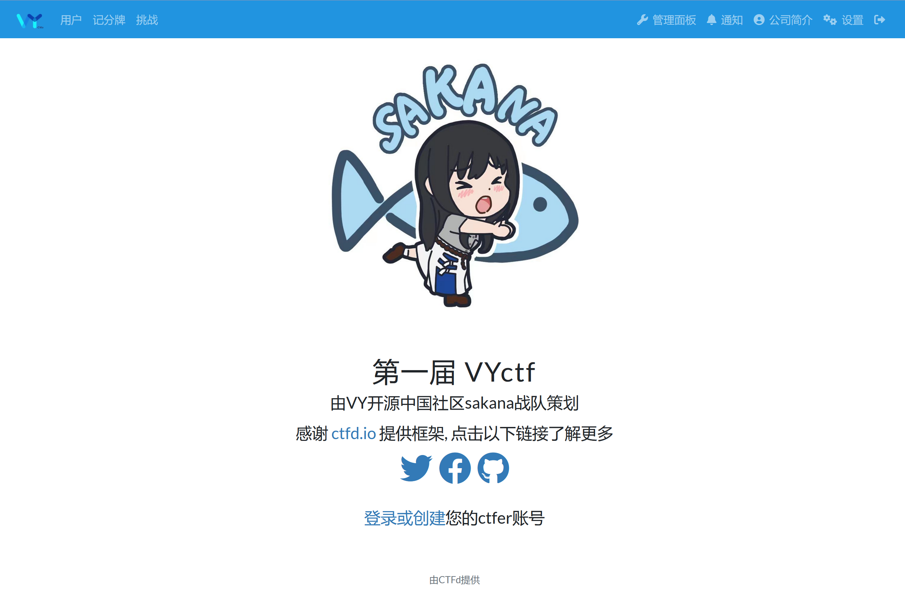
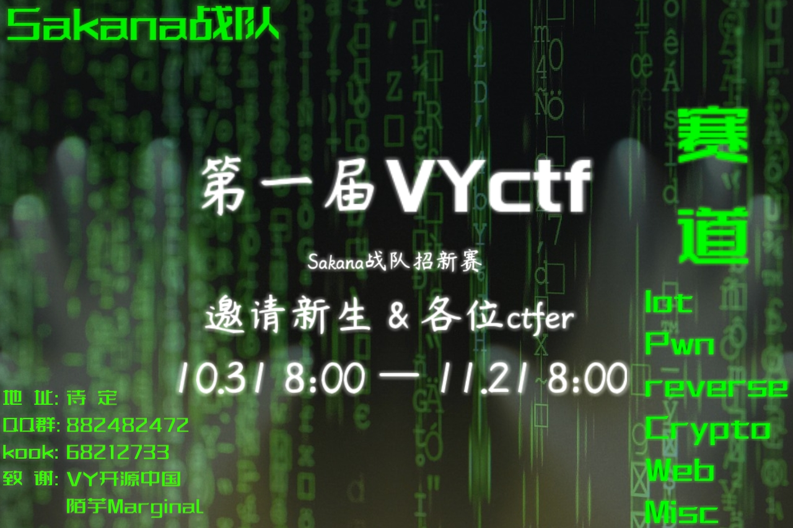

## 什么是VYctf
[ctf](https://ctf-wiki.org/)是网络安全竞赛中一种较为基础的比赛模式, [VYctf](https://www.bilibili.com/video/BV1q84y1m7JD)由VY开源社区旗下的sakana战队进行出题, sakana战队曾参与过rwctf, codegate, 天网杯, 金砖杯等多个比赛, 当前队长为*cve_wuya*.

## 参赛对象
不只欢迎新生参加比赛, 各位ctfer或者对于网络安全的爱好者都可以前来尝试挑战. 当然, 对于范围校外赛道我们现在还无法进行评奖与预约线下iot, 我们会在以后考虑将范围从校园扩大到尽可能多的参赛选手.
## 为什么适合从VYctf入坑
* VYctf的题目更加简单且适合. 其中简单指题目考点更加专一, 没有多层套娃; 适合指题目考点更加偏向于技术方面, 而不是以脑洞为主, 我们希望在每解出一个题都能让参赛的新生学到点什么.
* VYctf的比赛时间有20天, 足够大家从0开始进行学习.
* VYctf除了常见赛道以外还增加了**iot**赛道, 赛道分为线上与线下两种题目类型, 为考虑加入sakana战队的参赛新生下一届报名天网杯进行铺垫.
* 本次VYctf由开源社区发起, 没有各种繁琐的限制, 让出题人和参赛选手们能够享受到更加自由的参赛氛围.
## 需要准备什么
作为一场足够友善的新生赛, 你只需要一台电脑即可报名参赛, 我们准备了参赛QQ群与kook服务器以方便随时通知参赛地址, 拿到地址后只需要注册账号即可报名参赛.
