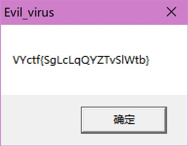

# kawaii病毒
本题主要考察逆向研究mingw代码, 也可以选择暴力逆向.

## 暴力解题
用了很简单的xor逻辑, 并用upx 4.1.0加了层壳, 大致可以参考[flag.c](../project/flag.c)文件, 不再过多赘述.

## 预期解
以retdec为例, 将代码反编译后得到`flag.c`文件, 算了懒得开vim找代码了, 大概意思就是有一个函数会判别当前目录文件数.
打开后删掉当前目录下一个文件, 让判别值小于打开时的值, 得到flag:

`VYctf{SgLcLqQYZTvSlWtb}`